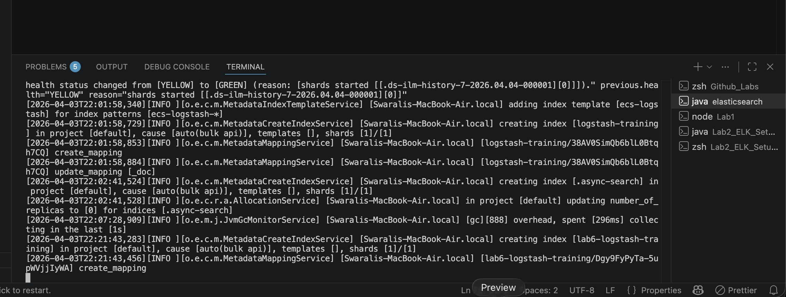
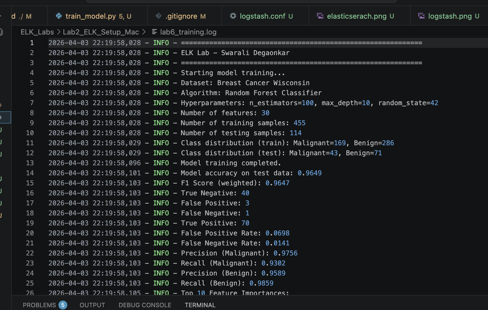
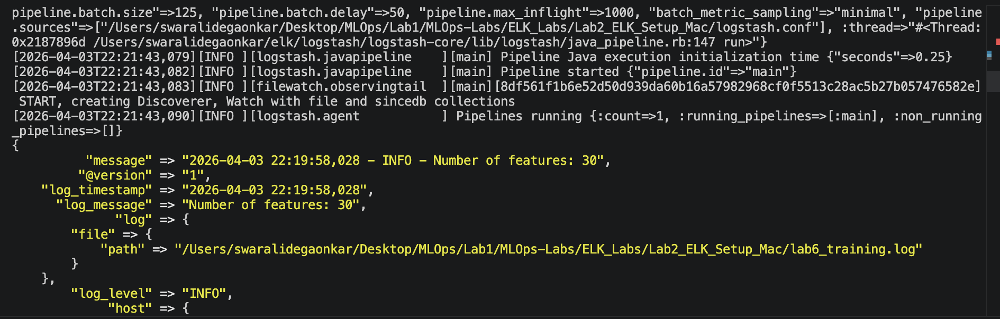
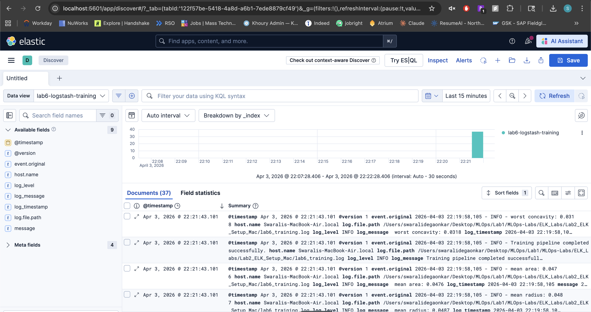

# ELK Stack for ML Training Log Management

**Author:** Swarali Degaonkar

This lab demonstrates setting up the ELK (Elasticsearch, Logstash, Kibana) stack for centralized log management and visualization of a machine learning training pipeline. A Random Forest classifier is trained on the Breast Cancer Wisconsin dataset, with structured logs ingested and visualized through the ELK stack.

## Overview

The pipeline follows this flow:

1. **Train the model** — `train_model.py` trains a Random Forest classifier and writes structured logs to `lab6_training.log`
2. **Logstash** — reads the log file, parses each line into structured fields (timestamp, level, message) using a grok filter, and forwards them to Elasticsearch
3. **Elasticsearch** — stores and indexes the structured log data
4. **Kibana** — provides a web UI to search, filter, and visualize the logs

## Dataset & Model

- **Dataset:** [Breast Cancer Wisconsin](https://scikit-learn.org/stable/modules/generated/sklearn.datasets.load_breast_cancer.html) — 569 samples, 30 features, binary classification (malignant vs benign)
- **Algorithm:** Random Forest Classifier (`n_estimators=100`, `max_depth=10`)
- **Metrics logged:** accuracy, F1 score, confusion matrix (TP, TN, FP, FN), false positive/negative rates, per-class precision and recall, top 10 feature importances

## Prerequisites

- **Java:** ELK stack requires Java. Install via Homebrew: `brew install openjdk@17`
- **Python 3.10+** with `scikit-learn` and `numpy`
- **ELK Stack:** Elasticsearch, Logstash, Kibana (all version 9.x)

## Project Structure

```
Lab2_ELK_Setup_Mac/
├── README.md
├── train_model.py
├── logstash.conf
├── lab6_training.log
├── LICENSE
└── Images/
    ├── elasticsearch.png
    ├── kibana_discover.png
    ├── logstash.png
    └── training_log.png
```

## Setup Instructions

### 1. Install and Configure ELK

Download Elasticsearch, Kibana, and Logstash from [elastic.co/downloads](https://www.elastic.co/downloads/) and extract them:

```bash
mkdir -p ~/elk
tar -xzf ~/Downloads/elasticsearch-*.tar.gz -C ~/elk/ && mv ~/elk/elasticsearch-* ~/elk/elasticsearch
tar -xzf ~/Downloads/kibana-*.tar.gz -C ~/elk/ && mv ~/elk/kibana-* ~/elk/kibana
tar -xzf ~/Downloads/logstash-*.tar.gz -C ~/elk/ && mv ~/elk/logstash-* ~/elk/logstash
```

On macOS, remove the quarantine attribute:

```bash
xattr -r -d com.apple.quarantine ~/elk/elasticsearch
xattr -r -d com.apple.quarantine ~/elk/kibana
sudo xattr -r -d com.apple.quarantine ~/elk/logstash
```

Add these lines to `~/elk/elasticsearch/config/elasticsearch.yml`:

```yaml
xpack.ml.enabled: false
xpack.security.enabled: false
xpack.security.enrollment.enabled: false
```

### 2. Start the ELK Stack (3 separate terminals)

**Terminal 1 — Elasticsearch:**
```bash
cd ~/elk/elasticsearch && ./bin/elasticsearch
```
Verify at `http://localhost:9200`.

**Terminal 2 — Kibana:**
```bash
cd ~/elk/kibana && ./bin/kibana
```
Verify at `http://localhost:5601`.

### 3. Train the Model

```bash
pip install scikit-learn numpy
python train_model.py
```

This generates `lab6_training.log` with structured training logs.

### 4. Run Logstash

Update the `path` in `logstash.conf` to the absolute path of `lab6_training.log`, then:

**Terminal 3 — Logstash:**
```bash
~/elk/logstash/bin/logstash -f /absolute/path/to/logstash.conf
```

### 5. Visualize in Kibana

1. Open `http://localhost:5601`
2. Go to **Management → Stack Management → Data Views**
3. Create a data view with index pattern `lab6-logstash-training` and timestamp field `@timestamp`
4. Navigate to **Analytics → Discover** and select the data view
5. Set the time range to **Last 1 year** to see all logs

## Logstash Configuration

The `logstash.conf` file defines three stages:

- **Input:** Reads from `lab6_training.log` using the file input plugin
- **Filter:** Uses a grok pattern to parse each log line into `log_timestamp`, `log_level`, and `log_message` fields
- **Output:** Sends structured data to Elasticsearch under the `lab6-logstash-training` index, and prints to stdout for debugging

## Screenshots

### Elasticsearch Running


### Training Log Output


### Logstash Parsed Output


### Kibana Discover View


## Cleanup

To remove the ELK installation after completing the lab:

```bash
rm -rf ~/elk
rm ~/Downloads/elasticsearch-*.tar.gz ~/Downloads/kibana-*.tar.gz ~/Downloads/logstash-*.tar.gz
```