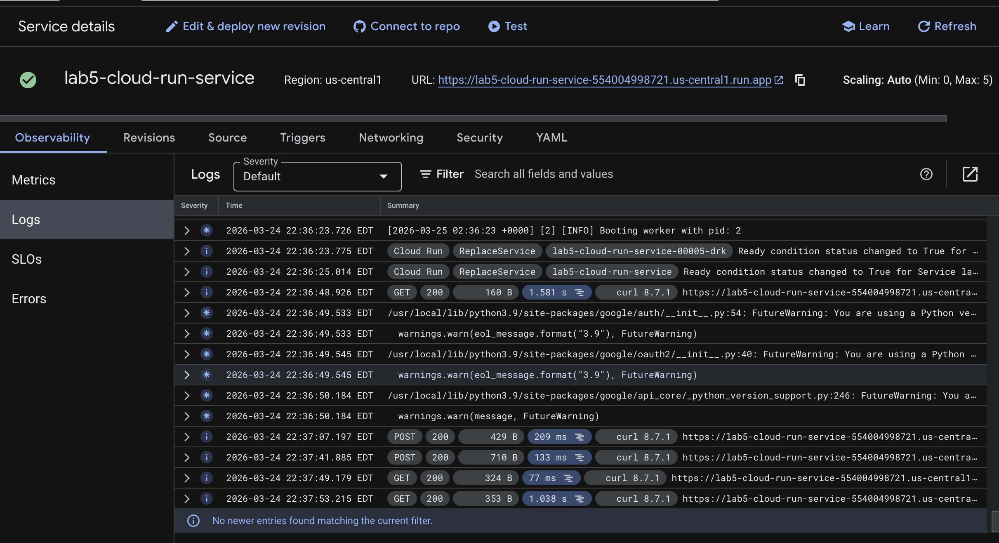
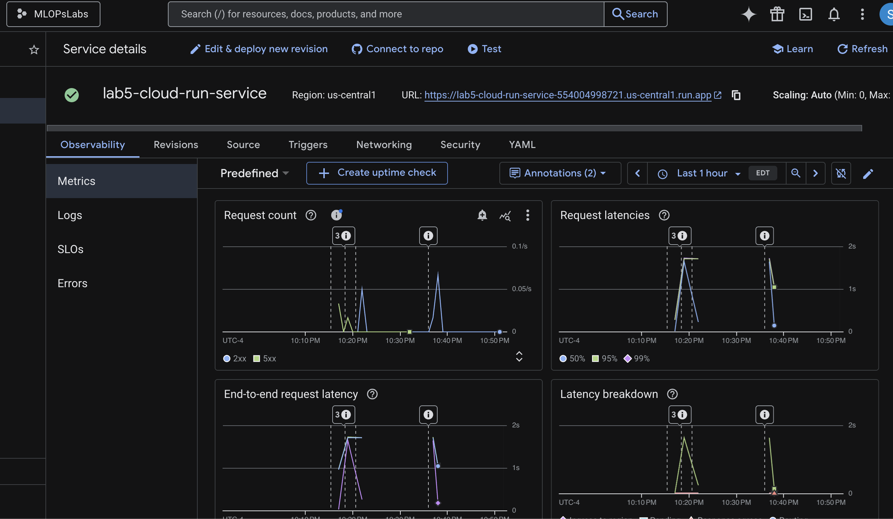
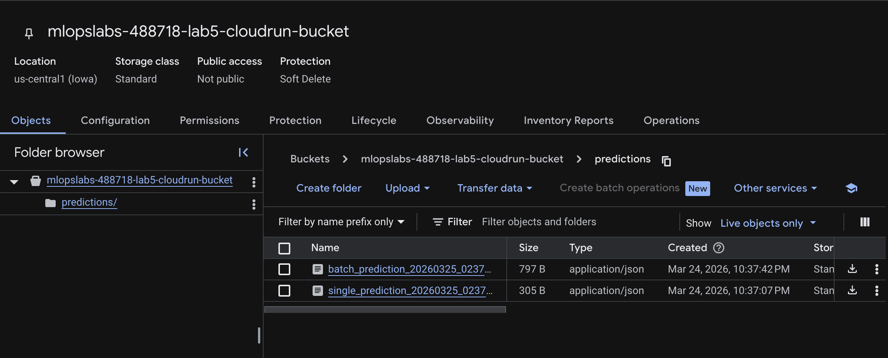
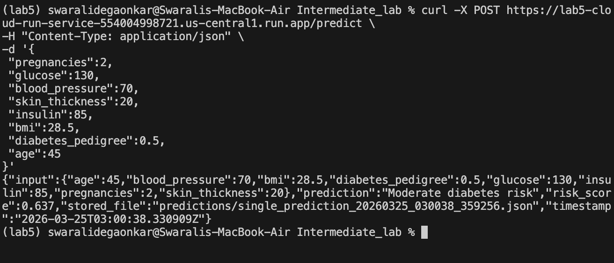

# Cloud Run ML Pipeline — Diabetes Risk Prediction Service

This project extends the original Cloud Run intermediate lab into a mini machine learning pipeline service while keeping the cloud infrastructure unchanged.

The application simulates an end-to-end ML workflow using a diabetes-style dataset inspired by Kaggle datasets. It demonstrates how containerized services can perform inference, store artifacts, and integrate with Google Cloud Storage and BigQuery.

The infrastructure remains identical to the original lab. Only the application logic was modified.

---

# Architecture Overview

Infrastructure reused:

- Google Cloud Run
- Docker container
- Google Cloud Storage bucket
- BigQuery public dataset
- Service Account authentication
- Environment variables
- Cloud Logging

---

# Features

Dataset ingestion using REST API

ML inference using simulated diabetes risk scoring model

Batch prediction support

Prediction artifact storage in Cloud Storage

Analytics endpoint using BigQuery public dataset

Logging and monitoring through Cloud Run logs

---

# Screenshots

All screenshots are stored in the `Images/` folder.

---

# Dataset Schema

The service uses a diabetes dataset structure inspired by Kaggle datasets.

Example input JSON:

{
  "pregnancies": 2,
  "glucose": 130,
  "blood_pressure": 70,
  "skin_thickness": 20,
  "insulin": 85,
  "bmi": 28.5,
  "diabetes_pedigree": 0.5,
  "age": 45
}

Prediction output example:

{
  "risk_score": 0.637,
  "prediction": "Moderate diabetes risk"
}

---

# API Endpoints

GET /

Health check endpoint

Response:
Diabetes ML pipeline service running

---

POST /upload-dataset

Uploads dataset JSON to Cloud Storage

Example:

curl -X POST SERVICE_URL/upload-dataset \
-H "Content-Type: application/json" \
-d '[{...},{...}]'

---

POST /predict

Runs prediction on single patient record

Example:

curl -X POST SERVICE_URL/predict \
-H "Content-Type: application/json" \
-d '{
 "pregnancies":2,
 "glucose":130,
 "blood_pressure":70,
 "skin_thickness":20,
 "insulin":85,
 "bmi":28.5,
 "diabetes_pedigree":0.5,
 "age":45
}'

---

POST /batch-predict

Runs prediction on multiple records

Example:

curl -X POST SERVICE_URL/batch-predict \
-H "Content-Type: application/json" \
-d '[
 {
  "pregnancies":3,
  "glucose":150,
  "blood_pressure":80,
  "skin_thickness":25,
  "insulin":100,
  "bmi":29,
  "diabetes_pedigree":0.6,
  "age":48
 },
 {
  "pregnancies":0,
  "glucose":95,
  "blood_pressure":65,
  "skin_thickness":15,
  "insulin":70,
  "bmi":22,
  "diabetes_pedigree":0.2,
  "age":28
 }
]'

---

GET /artifacts

Lists files stored in Cloud Storage bucket

Example:

curl SERVICE_URL/artifacts

---

GET /analytics

Queries BigQuery public dataset to simulate analytics workflow

Example:

curl SERVICE_URL/analytics

---

# Cloud Storage Structure

Bucket stores artifacts generated during predictions

bucket-name/

datasets/
dataset_timestamp.json

predictions/
single_prediction_timestamp.json
batch_prediction_timestamp.json

---

# Technology Stack

Python

Flask

Docker

Google Cloud Run

Google Cloud Storage

BigQuery

REST API

Service Accounts

---

# Steps to Recreate the Project

1. Clone repository

git clone <repo-url>

cd project-folder

---

2. Set GCP project

gcloud config set project PROJECT_ID

---

3. Enable required APIs

gcloud services enable run.googleapis.com

gcloud services enable storage.googleapis.com

gcloud services enable bigquery.googleapis.com

gcloud services enable artifactregistry.googleapis.com

---

4. Create Cloud Storage bucket

gsutil mb -l us-central1 gs://BUCKET_NAME

---

5. Create service account

gcloud iam service-accounts create cloud-run-lab5-sa

---

6. Assign permissions

gcloud projects add-iam-policy-binding PROJECT_ID \
--member="serviceAccount:cloud-run-lab5-sa@PROJECT_ID.iam.gserviceaccount.com" \
--role="roles/storage.admin"

gcloud projects add-iam-policy-binding PROJECT_ID \
--member="serviceAccount:cloud-run-lab5-sa@PROJECT_ID.iam.gserviceaccount.com" \
--role="roles/bigquery.user"

---

7. Build docker container

docker buildx build \
--platform linux/amd64 \
-t gcr.io/PROJECT_ID/lab5-cloud-run-app \
--load .

---

8. Push container image

docker push gcr.io/PROJECT_ID/lab5-cloud-run-app

---

9. Deploy to Cloud Run

gcloud run deploy lab5-cloud-run-service \
--image gcr.io/PROJECT_ID/lab5-cloud-run-app \
--region us-central1 \
--platform managed \
--allow-unauthenticated \
--update-env-vars BUCKET_NAME=BUCKET_NAME \
--service-account cloud-run-lab5-sa@PROJECT_ID.iam.gserviceaccount.com

---

10. Test endpoints

curl SERVICE_URL/

curl SERVICE_URL/artifacts

curl SERVICE_URL/analytics

curl -X POST SERVICE_URL/predict ...

curl -X POST SERVICE_URL/batch-predict ...

---

# Logging

View logs using:

gcloud run services logs read lab5-cloud-run-service --region us-central1

Logs include:

request activity

container startup

errors

prediction calls

---

## Cloud Run Metrics

The metrics tab shows request activity, container instances, and latency.

This demonstrates that the deployed ML service is receiving traffic and operating correctly.

---

## Cloud Storage Artifacts

Prediction outputs and datasets are stored as JSON files in Cloud Storage.

This verifies that the service successfully stores ML artifacts.

---

## API Output

Example output from the ML prediction endpoint.

Shows risk score and prediction label.

---

# Learning Outcomes

Containerized ML services

REST API design for ML inference

Batch prediction pipeline

Artifact storage using Cloud Storage

BigQuery integration

Service account authentication

Reproducible deployment using Docker

Cloud logging for observability

---